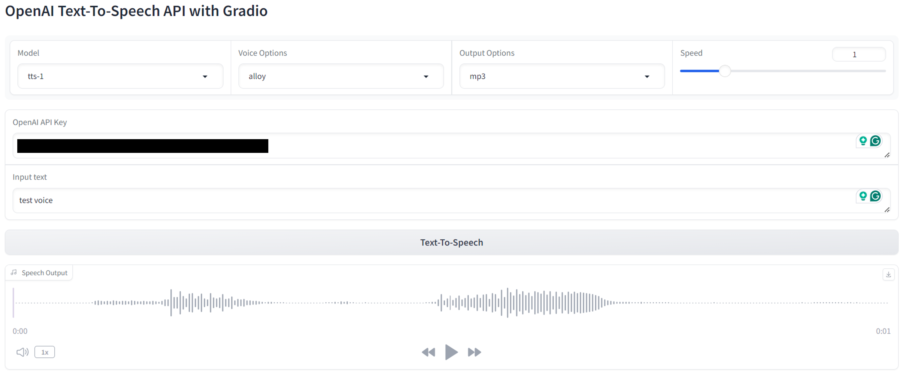

# OpenAI TTS Gradio Interface

This is a simple Gradio Interface to use OpenAI Text-to-Speech API. The interface looks like this:



## Usage

Get your OpenAI API key following the tutorial [here](https://platform.openai.com/docs/quickstart). I use [Miniforge](https://github.com/conda-forge/miniforge) to set up the environment, but you can use Anaconda or any other package manager.

```bash
mamba env create -f env.yml # Create the environment
conda activate openai_tts # Activate the environment
python app.py # Run the app
```
